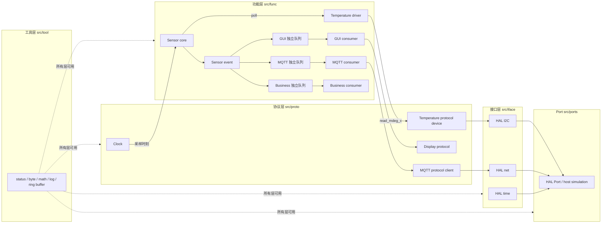

# Sensor 框架逐文件源码导读

本文以 2026-08-09 工作树中的 `src/**/*.c`、`src/**/*.h` 和
`examples/host_demo/main.c` 为唯一事实来源，面向维护、Port 移植与功能扩展。
框架中的定点温度统一用 `mdeg_c`（毫摄氏度）表示；例如 `25000` 表示
25.000 °C，避免在嵌入式主链中引入浮点依赖。

## 1. 分层、所有权与两条主链

依赖只允许沿 **功能层 → 协议层 → 接口层** 下行，具体硬件或主机实现位于
Port；工具层不含业务依赖，可被所有层使用。各对象都由调用方提供存储并持有
生命周期，初始化函数只绑定指针、清零状态或复制配置，框架不动态分配内存。

采样主链是 **clock → sensor core → temperature driver → protocol device →
HAL Port**；发布主链是 **sensor event → 三个独立队列 → GUI、MQTT、business
consumers**。独立队列意味着慢消费者只使自己的队列丢事件，不会把其他消费者
的数据取走。图中的 Clock 通过 `proto_clock_t` 读取 `hal_time_t`；Host Demo 为了
展示故障时序而直接计算 `now_ms`，生产调度器则由 runtime 统一读取 Clock。

## 2. 工具层 `src/tool`

### `src/tool/util_cfg.h`

- **职责与类型：** 纯配置头，只定义日志格式缓冲区上限
  `UTIL_CFG_LOG_LINE_MAX=128`，没有结构体字段。
- **公开契约与内部逻辑：** 没有函数或运行逻辑；宏在编译期确定静态数组大小，
  因而不需要对应 `.c`。
- **依赖边界：** 工具层自有配置，不包含上层头文件。

### `src/tool/util_status.h`

- **职责与类型：** 把 `sns_status_t` 定义为 `int32_t`。全部状态值为：
  `SNS_OK=0`、`SNS_ERR_PARAM=-1`、`SNS_ERR_STATE=-2`、
  `SNS_ERR_NOT_FOUND=-3`、`SNS_ERR_NOT_READY=-4`、`SNS_ERR_TIMEOUT=-5`、
  `SNS_ERR_IO=-6`、`SNS_ERR_CRC=-7`、`SNS_ERR_NO_SPACE=-8`、
  `SNS_ERR_UNSUPPORTED=-9`、`SNS_ERR_INVALID_DATA=-10`。
- **公开契约：** `sns_status_name` 把状态码转换为稳定的诊断字符串。
- **内部逻辑与边界：** 头文件只有类型、常量与声明，无运行逻辑；它只依赖
  `<stdint.h>`，是所有层共享的错误契约。

### `src/tool/util_status.c`

- **职责：** 实现 `sns_status_name`；逐项返回 `OK`、`PARAM`、`STATE`、
  `NOT_FOUND`、`NOT_READY`、`TIMEOUT`、`IO`、`CRC`、`NO_SPACE`、
  `UNSUPPORTED`、`INVALID_DATA`，未识别值返回 `UNKNOWN`。
- **类型/函数：** 不新增类型，也没有内部函数；唯一外部函数不修改状态。
- **依赖边界：** 仅实现 `util_status.h` 的工具层契约。

### `src/tool/util_byte.h`

- **职责与公开契约：** 声明 `util_be16_read` 与 `util_be16_write`，在字节数组
  和 16 位大端整数之间转换。
- **类型/内部逻辑：** 不定义对象类型，头文件无运行逻辑；容量和空指针错误统一
  返回 `SNS_ERR_PARAM`。
- **依赖边界：** 只依赖定宽整数与 `util_status.h`。

### `src/tool/util_byte.c`

- **职责与函数：** `util_be16_read` 先在局部变量中拼接高、低字节，成功后才写
  输出；`util_be16_write` 分别写高 8 位和低 8 位。两者要求容量至少 2。
- **类型/内部逻辑：** 不新增类型或内部函数；实现不假设主机字节序。
- **依赖边界：** 纯工具实现，不访问协议或 HAL。

### `src/tool/util_math.h`

- **职责与公开契约：** `util_div_round_nearest_i64` 做有符号 64 位除法并四舍五入
  到最近整数；`util_sat_i64_to_i32` 把结果饱和到 `int32_t`。
- **类型/内部逻辑：** 不定义状态对象，声明头没有运行逻辑。
- **依赖边界：** 只依赖整数类型和通用状态码。

### `src/tool/util_math.c`

- **职责与函数：** 除法对正负数采用“绝对余数达到半个分母时远离零”规则；
  `INT64_MIN/-1` 饱和为 `INT64_MAX`。饱和函数分别夹到 `INT32_MIN/MAX`。
- **重要内部函数：** `util_abs_i64_to_u64` 通过无符号运算安全取得
  `INT64_MIN` 的绝对量，避免有符号溢出。
- **依赖边界：** 工具层内部实现，不了解温度单位。

### `src/tool/util_log.h`

- **职责与类型字段：** `util_log_level_t` 为 DEBUG/INFO/WARN/ERROR；
  `util_log_sink_t` 是接收 context、level、tag、message 的回调；`util_log_t` 保存
  `sink`、`sink_context`、调用方缓冲区 `buffer` 和 `capacity`。
- **公开契约：** `util_log_init` 绑定上述 caller-owned 资源；`util_log_write`
  接收 printf 风格可变参数并把格式化结果送到 sink。
- **内部逻辑与边界：** 头文件只描述契约；日志工具不选择输出设备，上层或 Port
  通过 sink 决定去向。

### `src/tool/util_log.c`

- **职责与函数：** `util_log_init` 校验非空 sink/缓冲区和非零容量并清空首字节；
  `util_log_write` 用 `vsnprintf` 格式化，强制末字节为 `\0`，格式化失败返回
  `SNS_ERR_INVALID_DATA`，成功才调用 sink。截断文本仍作为合法、已终止字符串发送。
- **类型/内部函数：** 使用头文件对象，无额外内部函数。
- **依赖边界：** 只依赖 C 标准格式化库，不依赖 HAL。

### `src/tool/util_ringbuf.h`

- **职责与类型字段：** 通用定长元素环形缓冲区。策略类型
  `util_ringbuf_overflow_policy_t` 为 DROP_NEWEST 或 DROP_OLDEST；`util_ringbuf_t` 保存调用方
  `storage`、`item_size`、真实可用槽数 `capacity`、`head`、`tail`、显式
  `count`、累计 `dropped` 和溢出策略。策略为 `DROP_NEWEST` 或 `DROP_OLDEST`。
- **公开契约：** `util_ringbuf_init` 建立队列，`util_ringbuf_push`/
  `util_ringbuf_pop` 管理元素，`util_ringbuf_count`/`util_ringbuf_dropped` 查询状态。
- **容量语义：** 通过 `count==0` 判空、`count==capacity` 判满，所以 head 与 tail
  相等并不单独表示空；全部 `capacity` 个槽都可用，没有浪费哨兵槽。
- **依赖边界：** 存储与元素生命周期由调用方负责，工具不知道元素含义。

### `src/tool/util_ringbuf.c`

- **职责与公开行为：** `init` 清零索引和计数；满时两种策略都会增加
  `dropped`。`DROP_NEWEST` 保持原队列并返回 `SNS_ERR_NO_SPACE`；
  `DROP_OLDEST` 先前移 head、减 count，再写新元素并返回成功。空队列 `pop`
  返回 `SNS_ERR_NOT_FOUND`，查询函数对空对象指针返回 0。
- **重要内部函数：** `util_ringbuf_next_index` 在末槽回绕到 0；
  `util_ringbuf_item_at` 用 `index*item_size` 计算字节地址。
- **依赖边界：** 只用 `memcpy` 搬运固定大小元素，不持有元素内部资源。

## 3. 接口层 `src/iface`

### `src/iface/hal_cfg.h`

- **职责与类型：** 纯配置头，给 Host Port 固化 I2C 最多 8 设备、单次 512 字节，
  网络主机名 127 字符、包 512 字节、发送捕获 16 包、接收队列深度 8。
- **公开契约与内部逻辑：** 只有编译期宏，没有函数、对象或运行逻辑。
- **依赖边界：** 接口层配置被 host_sim 使用，不反向包含 Port。

### `src/iface/hal_gpio.h`

- **职责与类型字段：** GPIO 抽象。`hal_gpio_mode_t` 含输入、输出、上拉输入、下拉
  输入；`hal_gpio_level_t` 为 LOW/HIGH。`hal_gpio_ops_t` 提供
  `configure/write/read`，`hal_gpio_t` 只保存
  `ops` 与不透明 `ctx`。
- **公开契约与内部逻辑：** 公开契约就是回调表，没有包装函数或 `.c` 运行逻辑，
  具体引脚语义由 Port 实现。
- **依赖边界：** 接口层只依赖通用状态码，协议/功能层可持有抽象句柄。

### `src/iface/hal_i2c.h`

- **职责与类型字段：** `hal_i2c_ops_t.transfer` 描述一次带地址的写/读事务，参数
  包含 tx、rx 容量、超时和实际接收数；`hal_i2c_t` 为 `ops+ctx`。
- **公开契约与内部逻辑：** 头文件没有包装函数；仅声明函数指针是为了让不同 Port
  在链接时提供行为，故没有运行逻辑。
- **依赖边界：** 协议层通过该抽象访问总线，不得包含 host_sim 实现。

### `src/iface/hal_net.h`

- **职责与类型字段：** 网络流抽象，`hal_net_ops_t` 含 `connect/send/recv/close`；
  send/recv 通过输出参数报告本次实际字节数。`hal_net_t` 保存 ops 与 ctx。
- **公开契约与内部逻辑：** 只有回调契约，无默认运行实现；非阻塞“暂时无数据”由
  Port 返回 `SNS_ERR_NOT_READY`。
- **依赖边界：** MQTT 只见此接口，不知道 socket 或 host_sim 捕获队列。

### `src/iface/hal_spi.h`

- **职责与类型字段：** SPI 抽象的 `hal_spi_ops_t` 提供全双工 `transfer`，携带
  tx/rx、长度、超时和 `transferred`；`hal_spi_t` 为 ops+ctx。
- **公开契约与内部逻辑：** 没有包装函数和运行逻辑，当前源码也没有 SPI Port；
  该头保留可移植协议驱动的公开契约。
- **依赖边界：** 不依赖任何具体控制器。

### `src/iface/hal_time.h`

- **职责与类型字段：** 时间抽象只有 `now_ms(ctx, &now_ms)`；`hal_time_t` 保存
  `hal_time_ops_t` 与 ctx。
- **公开契约与内部逻辑：** 声明头没有运行逻辑，单调性与回绕由具体 Port/调用者
  协作保证。
- **依赖边界：** `proto_clock` 使用前置声明隔离此完整定义。

### `src/iface/hal_uart.h`

- **职责与类型字段：** UART 抽象的 `hal_uart_ops_t` 提供带超时的 `send/recv` 和
  实际字节数输出；`hal_uart_t` 为 ops+ctx。
- **公开契约与内部逻辑：** 仅有回调表，无默认实现或运行逻辑；当前源码未提供
  UART Port。
- **依赖边界：** 接口不绑定波特率等平台配置，相关策略留给 Port。

## 4. Port：`src/ports`

### `src/ports/host_sim/host_i2c.h`

- **职责与类型字段：** 主机 I2C 总线模拟器。设备回调
  `host_i2c_device_transfer_fn` 接受寄存器写入和读缓冲；`host_i2c_device_t` 保存
  10 位范围内的地址、回调、ctx 和 `in_use`；`host_i2c_bus_t` 内嵌 8 个设备槽和
  512 字节 `rx_staging`。
- **公开契约：** `host_i2c_bus_init` 清零总线；`host_i2c_bus_bind` 生成 HAL 句柄；
  `host_i2c_bus_register` 注册地址唯一的模拟设备。
- **内部逻辑与边界：** 声明头无运行逻辑；这是 Port 类型，协议层只应看到
  `hal_i2c_t`。

### `src/ports/host_sim/host_i2c.c`

- **职责与公开行为：** bind 把静态 `host_i2c_ops` 与 bus 填入 HAL；register
  拒绝空回调、超过 `0x3ff` 的地址和重复地址，设备槽满返回 `SNS_ERR_NO_SPACE`。
  transfer 先让设备写入 staging，校验完成数不超过容量后才复制到调用方 rx，
  避免失败事务污染输出。
- **重要内部函数：** `host_i2c_find` 线性查找已占用地址；`host_i2c_transfer` 是 HAL
  回调并传播设备错误、校验接收长度。
- **依赖边界：** 只在 Port 中知道模拟设备表，向上暴露标准 `hal_i2c_ops_t`。

### `src/ports/host_sim/host_net.h`

- **职责与类型字段：** `host_net_packet_t` 是 512 字节数据加 length；`host_net_t`
  保存连接标志、主机名/端口、16 个发送捕获包，以及深度 8 的 RX 队列和读写索引、
  count。
- **公开契约：** `host_net_init`/`host_net_bind`，`host_net_receive_push` 注入接收包，
  `host_net_capture_at` 读取已发送包的内部只读指针，`host_net_reset_captures` 清捕获
  计数，`host_net_capture_count`/`host_net_is_connected` 返回捕获数和连接状态。
- **内部逻辑与边界：** 头文件描述测试夹具存储，不进入 MQTT 协议层。

### `src/ports/host_sim/host_net.c`

- **职责与公开行为：** init 清零，bind 安装静态 ops；注入包检查单包/队列容量；
  capture 查询越界返回 `SNS_ERR_NOT_FOUND`。查询函数对 NULL 返回 0。
- **重要内部函数：** `host_net_connect` 记录合法主机名和端口并置 connected；
  `host_net_send` 要求已连接，把每次 HAL send 原样作为一个 capture；
  `host_net_recv` 在无包时返回 `SNS_ERR_NOT_READY`，容量足够才整包弹出；
  `host_net_close` 清连接标志。
- **依赖边界：** 模拟器保留“每次 send 一包”的测试可观测性，不代表真实 TCP
  消息边界；向协议层仍只暴露 `hal_net_t`。

### `src/ports/host_sim/host_time.h`

- **职责与类型字段：** `host_time_t` 只保存可控 `now_ms`，便于确定性测试。
- **公开契约：** `host_time_init`/`host_time_bind`，以及 `host_time_set` 绝对设置、
  `host_time_advance` 增量推进。
- **内部逻辑与边界：** 声明头没有运行逻辑；只有 Host Port 可直接操纵时钟。

### `src/ports/host_sim/host_time.c`

- **职责与公开行为：** bind 安装静态 time ops；set/advance 修改 caller-owned
  时钟，32 位加法按无符号回绕。
- **重要内部函数：** `host_time_now_ms` 校验参数、先取局部快照再写输出，是 HAL
  `now_ms` 的实现。
- **依赖边界：** 向上仅提供 `hal_time_t`，`proto_clock` 不知道时间来自模拟器。

### `src/ports/template/hal_i2c.c`

- **职责：** 新平台 I2C Port 的可编译骨架。外部链接函数
  `template_hal_i2c_bind` 安装静态 ops；当前文件没有配套公开头声明。
- **重要内部函数：** `template_i2c_transfer` 仅校验 `transferred`，将其置 0 并
  返回 `SNS_ERR_UNSUPPORTED`；真实移植需在这里调用平台驱动并填写完成数。
- **类型/边界：** 不新增类型，ctx 原样存入 `hal_i2c_t`；骨架不包含协议头，保持
  Port → 接口层边界。

### `src/ports/template/hal_net.c`

- **职责：** 网络 Port 骨架；`template_hal_net_bind` 安装 connect/send/recv/close
  回调，当前无配套公开头声明。
- **重要内部函数：** connect 检查 host；send/recv 检查缓冲组合并把实际数置 0；
  close 无条件返回不支持。四者都以 `SNS_ERR_UNSUPPORTED` 明示尚未接入平台网络。
- **类型/边界：** 不新增对象，只实现 `hal_net_t` 回调形状；移植代码不得向上泄露
  socket 类型。

### `src/ports/template/hal_time.c`

- **职责：** 时间 Port 骨架；`template_hal_time_bind` 安装 ops，当前无配套公开头。
- **重要内部函数：** `template_time_now_ms` 校验输出指针后返回
  `SNS_ERR_UNSUPPORTED`，真实 Port 应写入毫秒时刻。
- **类型/边界：** ctx 保持不透明，只依赖 `hal_time.h`。

## 5. 协议层 `src/proto`

协议头对 HAL 多采用 `typedef struct hal_xxx hal_xxx_t;` 前置声明。这样公开协议对象
可以保存 HAL 指针，却无需包含接口的完整定义；`.c` 才包含对应 HAL 头并解引用
ops。这既缩短编译依赖，也把“协议使用接口、接口不认识协议”的方向写进类型边界。

### `src/proto/proto_cfg.h`

- **职责与配置：** I2C 寄存器地址最多 4 字节、数据最多 512 字节；MQTT 默认发送
  槽数 8、最大包 512、host 128、client id 64，默认 poll 预算常量 2 ms。
  三个容量宏允许构建时覆盖。
- **公开契约与内部逻辑：** 纯配置头，没有类型、函数或运行逻辑；实际
  `proto_mqtt_poll` 的 `budget_ms` 由调用者传入。
- **依赖边界：** 只给协议实现和其调用方提供编译期大小。

### `src/proto/proto_clock.h`

- **职责与类型字段：** `proto_clock_t` 只保存前置声明的 `hal_time_t *time`。
- **公开契约：** `proto_clock_init` 绑定有效时间 HAL；`proto_clock_now_ms` 读取毫秒。
- **内部逻辑与边界：** 头文件不解引用 HAL，因此无须包含 `hal_time.h`；运行逻辑
  位于 `.c`。

### `src/proto/proto_clock.c`

- **职责与函数：** init 要求 `time->ops->now_ms` 有效；now 调用 HAL 回调，先写
  局部 value，成功后才更新输出并原样传播 Port 错误。
- **类型/内部函数：** 使用头文件对象，无内部辅助函数。
- **依赖边界：** 此实现才包含 `hal_time.h`，是协议层到接口层的唯一落点。

### `src/proto/proto_display.h`

- **职责与类型字段：** `proto_display_record_t` 保存 sensor_id、24 字节 value 文本、
  8 字节 unit、12 字节 quality 和 timestamp；`proto_display_ops_t.show` 是显示回调，
  `proto_display_t` 保存 ops+ctx。
- **公开契约：** `proto_display_show` 是校验后的统一转发入口。
- **内部逻辑与边界：** 声明头不渲染界面；功能层 GUI 生产 record，具体显示实现
  位于组合根或 Port。

### `src/proto/proto_display.c`

- **职责与函数：** `proto_display_show` 检查 display、ops、show 和 record 后，原样
  返回显示回调状态。
- **类型/内部函数：** 不新增类型或辅助函数。
- **依赖边界：** 仅做协议对象分派，不包含任何 GUI 功能逻辑。

### `src/proto/proto_i2c_reg.h`

- **职责与类型字段：** `proto_i2c_device_t` 保存前置声明的 HAL bus、从地址、
  `address_bits`（7 或 10）和事务超时。
- **公开契约：** `proto_i2c_device_init` 验证并组建设备；`proto_i2c_reg_read` 以
  寄存器字节作为 tx 后读取指定长度；`proto_i2c_reg_write` 拼接寄存器与数据后写出。
- **内部逻辑与边界：** 头文件不包含 `hal_i2c.h`，只暴露协议级寄存器访问。

### `src/proto/proto_i2c_reg.c`

- **职责与公开行为：** init 用 candidate 临时对象做到验证失败不污染输出。read
  使用 512 字节 staging，要求 HAL 实际接收数严格等于请求容量，否则
  `SNS_ERR_IO`；write 在栈上拼接最多 4+512 字节，写事务若报告非零接收数则
  `SNS_ERR_INVALID_DATA`。
- **重要内部函数：** `proto_i2c_device_validate` 检查 ops、超时、7 位 `<=0x7f`、
  10 位 `<=0x3ff`；其他位宽返回 `SNS_ERR_UNSUPPORTED`。
- **依赖边界：** 只通过 `hal_i2c_ops_t.transfer` 下行，向温度协议隐藏 HAL 事务细节。

### `src/proto/proto_temp.h`

- **职责与类型字段：** 温度设备的抽象协议。`proto_temp_ops_t` 提供 init 和
  `read_mdeg_c`；`proto_temp_device_t` 保存 ops+不透明 ctx。
- **公开契约与内部逻辑：** 纯接口头，没有包装函数或运行逻辑；驱动以此让功能层
  不依赖 TMP75 型号。
- **依赖边界：** 只依赖整数和状态码，不包含 I2C 或 HAL。

### `src/proto/proto_temp_tmp75.h`

- **职责与类型字段：** 定义温度寄存器 `0x00`；`proto_temp_tmp75_t` 保存
  `proto_i2c_device_t *i2c`。
- **公开契约：** `proto_temp_tmp75_init` 绑定 I2C 寄存器设备，
  `proto_temp_tmp75_bind` 生成通用 `proto_temp_device_t`，
  `proto_temp_tmp75_decode_mdeg_c` 公开纯解码函数，便于独立测试。
- **内部逻辑与边界：** 头文件连接两种协议抽象，不直接包含 HAL。

### `src/proto/proto_temp_tmp75.c`

- **职责与公开行为：** 读取回调通过 `proto_i2c_reg_read` 读取两字节温度寄存器，
  再调用公开 decode；init/bind 只绑定 caller-owned 对象。
- **重要内部函数：** `proto_temp_tmp75_ops_init` 校验上下文；
  `proto_temp_tmp75_read_mdeg_c` 实现 ops。decode 先大端读取 16 位原始值并右移 4 位
  得 12 位 code；若符号位 `0x0800` 置位，执行 `signed_code=code_bits-4096` 完成
  负温度符号扩展，再以 `signed_code*625/10` 四舍五入为 `mdeg_c`。例如 `0xFB00`
  得到 -5000 mdeg_c。
- **依赖边界：** 型号算法只依赖寄存器协议和 byte/math 工具，不访问 HAL。

### `src/proto/proto_mqtt.h`

- **职责与类型字段：** 定义 MQTT 3.1.1 QoS 0 客户端。状态为 DISCONNECTED、
  SENDING_CONNECT、WAITING_CONNACK、CONNECTED。`proto_mqtt_packet_slot_t` 内嵌
  packet data、length、已发送偏移 sent。`proto_mqtt_client_t` 保存 HAL net、
  caller-owned slots 与工作缓冲、环形队列索引/count/dropped、CONNECT/PING 控制包
  偏移、接收累积长度、连接参数、I/O/重连/CONNACK 时刻和状态标志。
- **公开契约：** `proto_mqtt_init`、`proto_mqtt_connect`、
  `proto_mqtt_publish_enqueue`、`proto_mqtt_poll`、`proto_mqtt_close`，以及
  `proto_mqtt_pending`、`proto_mqtt_dropped`、`proto_mqtt_is_connected` 查询。连接
  标志只有协议 CONNACK 成功后才为真。
- **内部逻辑与边界：** 头文件只前置声明 `hal_net_t`；发送队列没有堆分配，slots
  和 work_buffer 均由调用方提供。

### `src/proto/proto_mqtt.c`

- **职责与编码：** `proto_mqtt_encode_remaining` 生成 MQTT 变长 Remaining Length；
  text 校验/复制要求非空并留终止符；CONNECT 编码协议名 `MQTT`、level 4、clean
  session、keepalive 和 client id。PUBLISH 是 QoS 0 固定头 `0x30`，入队满时只增加
  dropped 并返回 `SNS_ERR_NO_SPACE`。
- **连接状态机：** transport connect 成功后仍是 SENDING_CONNECT，CONNECT 完整发出
  才转 WAITING_CONNACK。`proto_mqtt_process_connack` 要求固定头 `20 02`、ack flags
  为 0、return code 在 0..5；只有 return code 0 才置 CONNECTED/connected=1，拒绝
  CONNACK 返回 I/O 错误，畸形包返回 INVALID_DATA。成功还会处理同批剩余 PINGRESP。
- **发送、断线与重连：** `proto_mqtt_send_bytes` 支持部分发送。任何发送/接收协议
  错误调用 `proto_mqtt_mark_disconnected`：关闭 HAL、清控制/接收状态、指数退避从
  1000 ms 倍增到 30000 ms，并在队列非空时把队首 slot 的 `sent` 重置为 0。因此
  重连并再次通过 CONNACK 后，会从该 PUBLISH 的完整固定包头重发，而不是续传半包。
- **poll 与 keepalive：** DISCONNECTED 到期才重连，且仅该次 connect 的 timeout
  取 `min(connect_timeout_ms,budget_ms)`；该参数不是循环次数。其他状态每次 poll
  至多推进一次 send/recv/状态动作。已连接空闲达到 keepalive 时发 PINGREQ，等待
  同样一个 keepalive 周期仍无严格 `D0 00` PINGRESP 就超时断线；无可做工作返回
  `SNS_ERR_NOT_READY`。时间比较使用无符号差，支持 32 位回绕。
- **重要内部函数：** 除上述函数外，`receive_append/consume` 管理 caller-owned 工作
  缓冲，`process_connected_receive` 只接受完整 PINGRESP，
  `schedule_reconnect/attempt_connect` 管理退避和 CONNECT 起点。
- **依赖边界：** `.c` 才包含 `hal_net.h` 并调用 ops；协议不依赖 host_net。

## 6. 功能层 `src/func`

### `src/func/func_cfg.h`

- **职责与配置：** 纯配置头：最多 4 个 Sensor、12 个订阅、每 Sensor 4 个滤波器；
  MA 窗口最多 16、median 最多 9；温度默认连续错误阈值 3；GUI/MQTT/biz 建议
  队列容量分别为 8/16/16。
- **公开契约与内部逻辑：** 只有编译期宏，没有类型、函数或运行逻辑。
- **依赖边界：** 功能层内部容量，不向协议或 HAL 下沉业务策略。

### `src/func/func_sensor_types.h`

- **职责与类型字段：** `func_sensor_id_t` 是 `uint16_t`；当前
  `func_measurement_kind_t` 只有 TEMPERATURE，`func_measurement_unit_t` 只有 MDEG_C，
  `func_quality_t` 为 VALID/STALE/ERROR。
  `func_sensor_event_t` 携带 sensor_id、kind、unit、定点 value、timestamp_ms、由 core
  分配的 sequence、quality 和导致本事件的 `sns_status_t status`。
- **公开契约与内部逻辑：** 纯数据契约头，没有函数或运行逻辑。
- **依赖边界：** 事件不持有协议设备指针，可跨功能消费者复制。

### `src/func/func_event_queue.h`

- **职责与类型字段：** Sensor 事件专用环形队列。`func_queue_overflow_policy_t` 为
  DROP_NEWEST/DROP_OLDEST；`func_event_queue_t` 保存调用方 event storage、真实容量、
  读写索引、显式 count、dropped 和该策略。
- **公开契约：** `func_event_queue_init`、`func_event_queue_push`、
  `func_event_queue_pop`；`func_event_queue_count`/`func_event_queue_dropped` 通过
  状态码加输出参数查询并校验对象。
- **容量语义与边界：** `count==0` 为空、`count==capacity` 为满，所有槽可用；每个
  消费者必须拥有独立 queue/storage，此类型不依赖工具层通用 ringbuf 实现。

### `src/func/func_event_queue.c`

- **职责与公开行为：** init 清零索引；满时先加 dropped，DROP_NEWEST 保持内容并
  返回 NO_SPACE，DROP_OLDEST 前移读索引后写入新事件；空 pop 返回 NOT_FOUND。
- **重要内部函数：** `queue_next` 负责回绕；`queue_valid` 除空指针外还检查索引、
  count 和策略的一致性，结构损坏返回 `SNS_ERR_STATE`。
- **依赖边界：** 按值复制 `func_sensor_event_t`，队列间没有共享消费游标。

### `src/func/func_sensor.h`

- **职责与类型字段：** `func_sensor_driver_ops_t` 定义 init/poll/deinit；poll 通过
  `event_ready` 区分“调用成功但无事件”。`func_sensor_registration_t` 保存
  id/name/ops/driver_ctx；`func_sensor_slot_t` 再保存 latest、next_sequence、has_latest。
  `func_sensor_subscription_t` 是 sensor_id+queue；`func_sensor_core_t` 内嵌固定
  slots/subscriptions、计数和 initialized。
- **公开契约：** `func_sensor_core_init`、`func_sensor_reset`、`func_sensor_register`、
  `func_sensor_subscribe`、`func_sensor_poll_all`、`func_sensor_get_latest`。
- **所有权与边界：** core 只保存 caller-owned 驱动上下文和队列指针；驱动属于
  功能层，具体温度源通过协议抽象注入。

### `src/func/func_sensor.c`

- **职责与公开行为：** init 清零并置 initialized；register 拒绝重复 id、先调用
  驱动 init，成功才占 slot；subscribe 要求 Sensor 已注册、队列有效且同一 id/queue
  组合不重复。reset 逐个 deinit 并保留首个错误，再清 Sensor 与订阅，但 core 保持
  initialized 可重新装配。get_latest 在尚无事件时返回 NOT_READY。
- **重要内部函数：** `find_sensor` 按 id 查 slot；`publish_event` 覆盖驱动临时 id 和
  sequence，保存 latest，然后遍历所有匹配订阅做 fan-out，某队列失败不阻止其他
  队列，最终返回首错。
- **poll 语义：** `func_sensor_poll_all` 按注册顺序轮询全部驱动；即使驱动返回错误，
  只要 `event_ready!=0` 仍发布 ERROR/STALE 事件，并继续其他 Sensor，最后返回首个
  发布或驱动错误。
- **依赖边界：** core 不识别温度、I2C 或消费者，仅协调通用驱动和事件队列。

### `src/func/func_temp.h`

- **职责与类型字段：** `func_temp_cfg_t` 保存通用温度源、采样周期、ppm gain 与
  mdeg_c offset、按值复制的 `func_filter_chain_t`、变化发布阈值、强制发布周期和错误阈值。
  `func_temp_t` 保存该配置、采样/有效发布时刻、最近有效/已发布值、连续错误数、
  最近质量和 initialized/sample_started/has_valid 等状态位。
- **公开契约：** `func_temp_configure`、driver 形状的 `func_temp_init`/
  `func_temp_poll`/`func_temp_deinit`，以及公开常量 ops `func_temp_driver_ops`；合法
  物理范围为 -55000..125000 mdeg_c。
- **所有权与边界：** cfg 中 source、filter items/state/cfg 都是 caller-owned；
  功能驱动只见 `proto_temp_device_t`，不依赖 TMP75。

### `src/func/func_temp.c`

- **配置与采样：** `temp_cfg_valid` 要求完整温度 ops、非零采样周期、非负变化阈值，
  gain 必须大于 -1000000 ppm。configure 复制配置并复位状态；init 先初始化滤波链，
  再初始化协议源。poll 用无符号时差处理时钟回绕，未到周期返回 OK 且不出事件。
- **有效数据路径：** 原始值先检查物理范围，再由 `temp_calibrate` 计算
  `raw*(1000000+gain)/1000000+offset` 并饱和，随后调用
  `func_filter_chain_process`。成功清零连续错误；首次有效、从非 VALID 恢复、变化达到
  阈值或强制周期到期才发布 VALID。deinit reset filters 后清 initialized。
- **质量状态机：** `temp_error_event` 每次错误都生成事件并返回原始 cause。没有历史
  有效值时直接 ERROR；已有有效值且连续错误数小于阈值时 STALE，达到阈值后 ERROR；
  下一次成功因最近质量非 VALID 而强制发布 VALID。因此阈值为 2 时可观察
  **VALID → STALE → ERROR → VALID**，错误事件的 value 保留最近有效值。
- **重要内部函数：** `temp_event_base` 填 kind/unit/time；`temp_publish_due` 用最近发布
  值和质量判断；`temp_cfg_valid/temp_calibrate/temp_error_event` 分离验证、换算和故障。
- **依赖边界：** 依赖通用 filter、proto_temp 和 math，不包含型号协议或 HAL。

## 7. 滤波框架 `src/func/filter`

### `src/func/filter/func_filter.h`

- **职责与类型字段：** `func_filter_value_t` 为 int32；`func_filter_ops_t` 是
  init/reset/process；`func_filter_instance_t` 保存 ops、caller-owned state、
  state_size、只读 cfg；`func_filter_chain_t` 保存 instance 数组和 count。
- **公开契约：** `func_filter_chain_init`、`func_filter_chain_reset`、
  `func_filter_chain_process`。实际源码中的处理函数名是
  `func_filter_chain_process`。
- **所有权与边界：** 框架不分配滤波状态，各具体滤波只通过 ops 被 chain 调度。

### `src/func/filter/func_filter.c`

- **职责与执行语义：** init 按数组顺序初始化最多 4 个 instance；reset 同序复位；
  process 令 `current=input`，每个滤波输出作为下一个输入，零长度 chain 原样输出。
  任一步返回错误就立即停止并原样传播；最终成功后才写调用方 `*output`。
- **重要内部函数：** `func_filter_instance_valid` 要求完整三回调、state、非零
  state_size 和 cfg。init 中无效配置返回原始校验错；运行/复位阶段结构异常归为
  `SNS_ERR_STATE`。
- **依赖边界：** 只依赖功能配置上限和工具状态码，不知道具体算法。

### `src/func/filter/func_filter_ma.h`

- **职责与类型字段：** `func_filter_ma_cfg_t` 只有 `window_size`；
  `func_filter_ma_state_t` 内嵌最多 16 个 samples、int64 sum、count、next_index 和
  实际窗口大小。
- **公开契约：** 导出 `func_filter_ma_ops`，没有独立调用函数。
- **所有权与边界：** 调用者声明 cfg/state 并放入 instance，头文件无运行逻辑。

### `src/func/filter/func_filter_ma.c`

- **职责与算法：** `ma_configure` 校验 state_size 和 1..16 窗口并清状态；init/reset
  复用它。`ma_process` 在窗口满后先减被覆盖样本，再加新样本，通过
  `util_div_round_nearest_i64` 计算热身期或完整窗口平均值。
- **重要内部函数：** `ma_configure/ma_init/ma_reset/ma_process` 都是 ops 内部函数；
  process 会检查 count/index/window 一致性。
- **依赖边界：** 只使用 math 工具，不依赖 Sensor 或协议。

### `src/func/filter/func_filter_ema.h`

- **职责与类型字段：** Q15 系数的 1.0 是 32768；`func_filter_ema_cfg_t` 保存
  `alpha_q15`，`func_filter_ema_state_t` 保存当前 value、复制后的 alpha 和 initialized。
- **公开契约：** 导出 `func_filter_ema_ops`；调用者提供 cfg/state。
- **内部逻辑与边界：** 头文件无运行逻辑，不知道采样单位。

### `src/func/filter/func_filter_ema.c`

- **职责与算法：** configure 要求 alpha 在 1..32768 并清初始化标志；首个输入直接
  成为输出，之后计算 `value + round(alpha*(input-value)/32768)`，结果饱和到 int32。
- **重要内部函数：** `ema_configure/init/reset/process` 构成静态 ops；process 在状态
  中的 alpha 非法时返回 STATE。
- **依赖边界：** 通过 math 工具做确定性定点运算。

### `src/func/filter/func_filter_median.h`

- **职责与类型字段：** `func_filter_median_cfg_t` 为窗口大小；
  `func_filter_median_state_t` 内嵌最多 9 个样本、count、next_index 和 window_size。
- **公开契约：** 导出 `func_filter_median_ops`，存储由调用者提供。
- **内部逻辑与边界：** 声明头不执行排序，算法不依赖 Sensor。

### `src/func/filter/func_filter_median.c`

- **职责与算法：** configure 校验 1..9 并清状态；process 写环形样本，再复制有效
  样本到栈上 sorted 数组，以插入排序求中位数。奇数取中项，偶数把中间两项相加后
  用 math 工具四舍五入除 2。
- **重要内部函数：** `median_configure/init/reset/process` 是静态 ops；运行前校验
  count/index/window 状态。
- **依赖边界：** 小固定窗口换取无堆分配和确定性上界。

### `src/func/filter/func_filter_limit.h`

- **职责与类型字段：** `func_filter_limit_cfg_t` 定义 min、max 和每样本最大变化
  `max_change`；`func_filter_limit_state_t` 复制这些限制，并保存 previous 与 initialized。
- **公开契约：** 导出 `func_filter_limit_ops`。
- **内部逻辑与边界：** 调用者拥有对象，头文件无运行逻辑。

### `src/func/filter/func_filter_limit.c`

- **职责与算法：** configure 拒绝 min>max 或负 max_change；process 先做绝对范围
  clamp，已有 previous 时再夹到 previous±max_change，使用 int64 计算边界以避免
  加减溢出，最后保存输出。
- **重要内部函数：** `limit_configure/init/reset/process` 构成静态 ops；状态配置异常
  返回 STATE。
- **依赖边界：** 纯 int32 输入输出，不感知 mdeg_c。

## 8. 应用消费者与 runtime `src/func/app`

### `src/func/app/func_app_gui.h`

- **职责与类型字段：** `func_app_gui_t` 保存自己的 event queue、display 协议对象和
  每次 poll 最大事件数。
- **公开契约：** `func_app_gui_init` 校验绑定，`func_app_gui_poll` 消费并显示。
- **所有权与边界：** queue/display 均由组合根拥有；GUI 不共享 MQTT/biz 队列。

### `src/func/app/func_app_gui.c`

- **职责与公开行为：** init 要求可用 show 和非零预算；poll 最多消费指定事件数，
  空队列视为正常完成。只接受 temperature+mdeg_c，把值格式化为三位小数和单位 C，
  包括 `-0.xxx` 特例，再调用 `proto_display_show`。
- **重要内部函数：** `func_app_gui_quality` 映射质量文本；`func_app_gui_record` 组装
  record 并检查 snprintf 容量。
- **依赖边界：** 功能消费者只生成显示协议记录，不访问显示硬件。

### `src/func/app/func_app_mqtt.h`

- **职责与类型字段：** `func_app_mqtt_t` 保存独立 queue、MQTT client、topic、单次
  消费上限和 192 字节 caller-owned 对象内 payload 缓冲。
- **公开契约：** `func_app_mqtt_init` 与 `func_app_mqtt_poll`。
- **所有权与边界：** 它只负责事件→MQTT PUBLISH 入队，网络推进由协议 client poll。

### `src/func/app/func_app_mqtt.c`

- **职责与公开行为：** poll 把每个 temperature/mdeg_c 事件格式化为 JSON，字段含
  sensor_id、kind、`value_mdeg_c`、quality、timestamp、sequence，再调用
  `proto_mqtt_publish_enqueue`；格式/队列错误立即返回，空事件队列返回 OK。
- **重要内部函数：** `func_app_mqtt_quality` 映射 valid/stale/error 文本。
- **依赖边界：** 不自行 connect/send，只依赖 MQTT 协议公开契约。

### `src/func/app/func_app_biz.h`

- **职责与类型字段：** `func_biz_result_t` 保存某 sensor 的
  min/max/average/sample_count、滞回高温 alarm、quality、timestamp。每个
  `func_biz_sensor_state_t` 有独立 sensor_id、
  caller-owned window、容量/计数/写位置、sum、alarm on/off、latest 和状态标志。
  `func_app_biz_t` 保存独立 queue、states 数组、state_count 和 poll 上限。
- **公开契约：** `func_biz_sensor_state_init` 初始化单 sensor state，
  `func_app_biz_init` 初始化 app，`func_app_biz_poll` 消费事件，
  `func_app_biz_get_latest` 按 sensor_id 查询 latest。
- **所有权与边界：** 窗口存储按 Sensor 分开，不能用一个状态混合多个 id。

### `src/func/app/func_app_biz.c`

- **职责与公开行为：** state init 要求非空窗口、非零容量及 off<=on；app init 检查
  每个 state 已初始化且 sensor_id 唯一。poll 按事件 id 找 state；未知 id 跳过；
  非 VALID 只更新该 id 的 quality/time，不污染数值窗口；VALID 事件更新对应环形窗口、
  sum、min/max/四舍五入 average，并用 on/off 阈值实现滞回 alarm。get_latest 也按
  sensor_id 定位，分别返回 NOT_FOUND 或 NOT_READY。
- **重要内部函数：** `func_app_biz_find_state` 是隔离关键；`func_app_biz_average` 对
  正负 sum 对称取最近整数；`func_app_biz_refresh` 重扫当前窗口并更新 latest。
- **依赖边界：** 业务统计只消费通用事件，不依赖温度协议或 HAL。

### `src/func/app/func_app_runtime.h`

- **职责与类型字段：** `func_app_runtime_t` 聚合 sensor_core、clock、可选 GUI/biz、
  成对出现的 mqtt_app/client 和 MQTT poll budget。
- **公开契约：** `func_app_runtime_init` 建立单 owner 调度对象；
  `func_app_runtime_poll_once` 读取当前时间并推进一次系统。
- **所有权与边界：** runtime 不拥有聚合对象内存，组合根必须保证其生命周期。

### `src/func/app/func_app_runtime.c`

- **职责与调度顺序：** init 要求已初始化 core 和 clock；MQTT app/client 必须同时
  提供，启用 MQTT 时预算非零。poll_once 只读取一次 clock，然后固定按 sensor core
  → GUI → biz → MQTT app → MQTT protocol 顺序推进，体现单 owner、单线程协作调度。
- **重要内部函数：** `func_app_runtime_capture` 忽略正常的 `SNS_ERR_NOT_READY`，对其余
  错误保留首错但不中止后续组件，保证消费者仍有机会排空。
- **依赖边界：** runtime 是功能层组合调度，不直接调用任何 HAL。

## 9. Host Demo 组合根

### `examples/host_demo/main.c`

该文件是 514 行的可执行装配示例，不是新的框架层。它刻意用静态/栈对象显式展示
所有权，并用主机夹具制造可重复的温度与网络故障。

1. **fixture 和回调。** `demo_tmp75_source_t` 保存总线名、原始寄存器 word 数组、
   对应状态数组、样本数和下一位置。`demo_tmp75_transfer` 要求一次写寄存器 `0x00`
   并读 2 字节，逐样本注入 OK/IO/TIMEOUT；`demo_display_show` 统计并打印 GUI record。
   `demo_require` 统一打印装配失败，`demo_print_biz` 按 id 输出业务结果。
2. **HAL/协议实例。** 两个 `host_i2c_bus_t` 分别在相同地址 `0x48` 注册各自 TMP75
   fixture，再分别绑定 `hal_i2c_t`、`proto_i2c_device_t`、`proto_temp_tmp75_t` 和
   `proto_temp_device_t`，证明总线对象隔离地址空间。网络侧绑定 `host_net_t` 与
   `hal_net_t`，MQTT 使用 2 个 caller-owned packet slots 和 256 字节 work buffer；
   Demo 注入严格成功的 `20 02 00 00` CONNACK 后才检查 connected。
3. **两个 Sensor 和滤波链。** Sensor A 的 chain 是窗口 2 的 MA → 每次最大变化
   2000 的 limit；Sensor B 是窗口 3 的 median → alpha=16384（0.5）的 EMA。两个
   `func_temp_cfg_t` 都以 100 ms 采样并强制每周期发布、错误阈值为 2，然后以 id 1/2
   注册到同一 core。A 的状态序列在有效值后注入 IO、TIMEOUT，演示
   VALID→STALE→ERROR→VALID；B 的 `0xFB00..0x0000` 覆盖负温度解码。
4. **GUI/MQTT/biz 三队列。** Demo 只创建 `gui_queue`、`mqtt_queue`、`biz_queue`
   三个事件队列，并把两个 Sensor 分别订阅到这三队列，共 6 个订阅。GUI/MQTT
   队列容量均 5 且 DROP_NEWEST，biz 容量 6 且 DROP_OLDEST；因此前三轮不消费时可
   观察 GUI/MQTT 各自的 dropped，而 biz 保留最近事件。业务侧有两个 id 独立的
   3 样本窗口与不同 alarm 滞回阈值。
5. **时间循环与故障注入。** 此示例没有装配 `proto_clock`/runtime，而以
   `step*100 ms` 直接调用 `func_sensor_poll_all`，随后手工轮询消费者，便于在精确
   step 插入错误。step 4 先让 MQTT app 入队，再主动关闭 host net；发送得到 STATE
   后 client 断线并保留队首包，1400 ms 触发重连、重发 CONNECT、注入新 CONNACK，
   最后从完整 PUBLISH 头排空积压。
6. **汇总输出与清理。** `demo_poll_consumers` 顺序排 GUI/biz；
   `demo_print_new_captures` 把首字节分类为 CONNECT/PUBLISH/PINGREQ 并打印最多 40
   字节；`demo_mqtt_flush` 有 16 次上限，`demo_mqtt_drain_app` 以 8 轮处理协议队列
   反压。末尾打印 GUI record 数、MQTT pending/dropped，随后 close client 并 reset
   core，触发两个温度驱动 deinit。

重要内部辅助函数清单为：`demo_tmp75_transfer`、`demo_display_show`、
`demo_require`、`demo_print_biz`、`demo_poll_consumers`、
`demo_print_new_captures`、`demo_mqtt_flush`、`demo_mqtt_drain_app`。`main` 本身是组合
根：它可以依赖所有层和具体 Port；生产功能/协议文件不能反向依赖本示例。

## 10. 维护与移植检查点

- **新增 Port：** 保持 `ops+ctx` ABI；先实现 template 中的回调和完成字节语义，
  再由组合根 bind。协议层不应包含平台 SDK 类型。
- **新增温度器件：** 实现新的 `proto_temp_ops_t`，保持输出为 `mdeg_c`；
  `func_temp_t`、滤波器与消费者无需了解寄存器格式。
- **新增消费者：** 分配独立 `func_event_queue_t` 和 storage，并为每个所需 sensor_id
  单独 subscribe；不要复用现有消费者队列。
- **调度：** 生产代码优先让 `func_app_runtime_poll_once` 成为唯一 owner；每次调用
  都是有界协作步骤，MQTT 的 NOT_READY 是空闲/等待状态而非故障。
- **错误可观测性：** Sensor core 即使返回首错也可能已经发布 STALE/ERROR 事件；
  调用者不能仅凭返回码推断“没有事件”。应同时让消费者排队运行并查看 event.status。
